# UVM Style Verification Plan

```mermaid
graph TD
    subgraph Test
        subgraph Environment
            
            %% Top Level
            SB[Scoreboard]

            %% Middle Level
            ConfigDB[Config DB]

            %% Bottom Level - Agents
            subgraph IMAgent [Instruction Memory Agent]
                IM_S[Sequencer] --> IM_D[Driver]
                IM_M[Monitor]
            end
            
            subgraph DecAgent [Decoder Agent]
                Dec_S[Sequencer] --> Dec_D[Driver]
                Dec_M[Monitor]
            end
            
            subgraph ALUAgent [ALU Agent]
                ALU_S[Sequencer] --> ALU_D[Driver]
                ALU_M[Monitor]
            end
            
            subgraph RegAgent [Register File Agent]
                Reg_S[Sequencer] --> Reg_D[Driver]
                Reg_M[Monitor]
            end
            
            %% Connections from ALL Monitors to Scoreboard
            IM_M  -- "Analysis Port" --> SB
            Dec_M -- "Analysis Port" --> SB
            ALU_M -- "Analysis Port" --> SB
            Reg_M -- "Analysis Port" --> SB

            %% Optional: Showing ConfigDB relationship (e.g. to the Env)
            ConfigDB -.-> IMAgent
            ConfigDB -.-> DecAgent
            ConfigDB -.-> ALUAgent
            ConfigDB -.-> RegAgent
        end
    end

    %% Visual Styling
    style SB fill:#345,stroke:#333,stroke-width:4px
    style ConfigDB fill:#344,stroke:#333,stroke-dasharray: 5 5
```



## UVM Testbench Topology

```plaintext
tb_top
 ├── instr_mem_agent
 │    ├── instr_mem_driver
 │    ├── instr_mem_monitor
 │    └── instr_mem_sequencer
 │          ├── instr_mem_sequence
 │          └── instr_mem_sequence_item
 │
 ├── decoder_agent
 │    ├── decoder_driver
 │    ├── decoder_monitor
 │    └── decoder_sequencer
 │          ├── decoder_sequence
 │          └── decoder_sequence_item
 │
 ├── alu_agent
 │    ├── alu_driver
 │    ├── alu_monitor
 │    └── alu_sequencer
 │          ├── alu_sequence
 │          └── alu_sequence_item
 ├── regfile_agent
 │    ├── regfile_driver
 │    ├── regfile_monitor
 │    └── regfile_sequencer
 │          ├── regfile_sequence
 │          └── regile_sequence_item
 │
 ├── scoreboard
 ├── coverage_collector
 └── virtual_sequencer
```

## UVM Agent Definition

### Instruction  Memory Agent (Active)

- Role
    - Drives 32-bits instructions
    - Drives `instr_valid`
    - Obsrves `next_instr`

- Driver Responsibilities
    - Assert `instr_valid` for exactly 1 cycle
    - Wait for `next_instr` before issuing next instruction

- Monitor Responsibilities
    - Sample instruction only when `instr_valid == 1`
    - Check protocol ordering (`next_instr → instr_valid`)

### Decoder Agent (Passive / Semi Active)

- Role
    - Observes instruction decode
    - Capture decoded signals

- Monitored Signals
    - `opcode`
    - `immediate`
    - `rs1_rs2_rd`
    - `rs_addr_valid`
    - `rd_wr_end`
    - `rs2_imme_sel`
    - `next_instr`

### ALU Agent (Passive)

- Role
    - Observes ALU operation
    - Validates latency & Correctness

- Monitored Signals
    - `opcode`
    - operands
    - `alu_data_out`
    - `alu_data_valid`
    - `op_done`

### Register File Agent (Passive)

## Scoreboard Strategy

### Reference Model

- Decode instuction in scoreboard
- Compute exact ALU result
- Track cycle latency
- Compare
    - `alu_data_out`
    - `alu_data_valid`
    - `rd_wr_en` behavior
- Checks
    - Data correctness
    - No spurious `alu_data_valid`
    - No instruction loss


## Coverage Plan

### Instruction Coverage

```sv
covergroup instr_cg;
  coverpoint opcode { bins valid[] = {[0:15]}; }
  coverpoint rs2_imme_sel;
  coverpoint rd_wr_en;
endgroup
```

### Decoder Coverage

- Opcode x immediate present
- Opcode x rd_wr_en
- rs_addr_valid toggling

### ALU Coverage

- Opcode functional coverage
- Operand corner cases (0, max, random)

## Assertions (SVA)


| Assertion Name | Intent | SVA Logic (Example) |
| :--- | :--- | :--- |
| **instr_valid_one_cycle** | `instr_valid` is a 1-cycle pulse | `$rose(instr_valid) \|=> !instr_valid` |
| **next_instr_before_instr** | `instr_valid` only after `next_instr` | `instr_valid \|-> $past(next_instr)` |
| **alu_valid_after_2_cycles** | `alu_data_valid` asserted after 2 cycles | `start_alu \|-> ##2 alu_data_valid` |
| **no_write_without_rd_en** | No reg write when `rd_wr_en=0` | `!rd_wr_en \|-> !reg_write` |
| **op_done_triggers_next** | `op_done` → `next_instr` | `op_done \|-> next_instr` |

